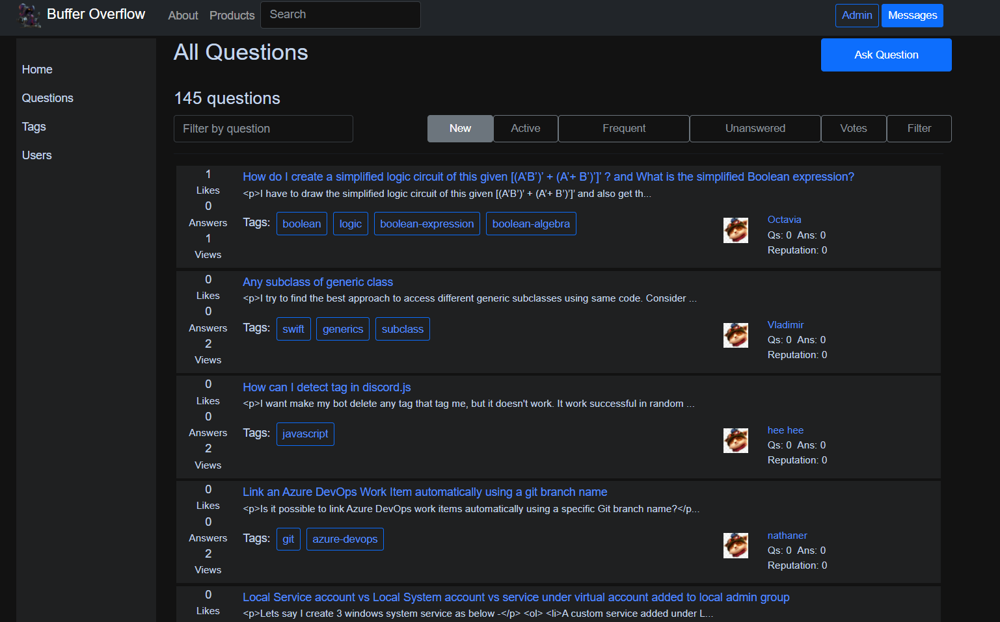
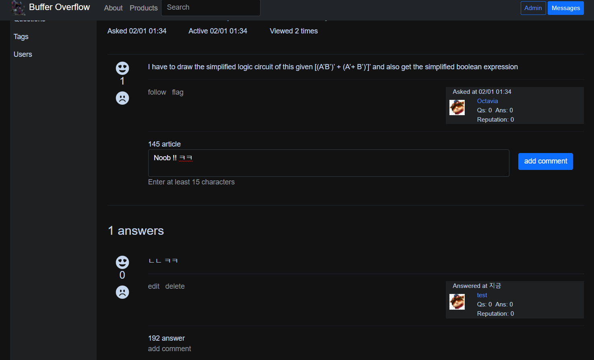
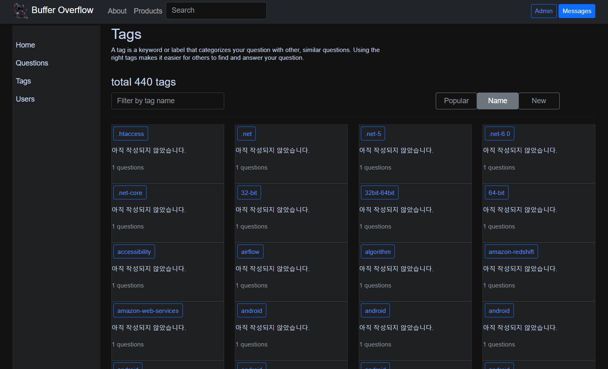
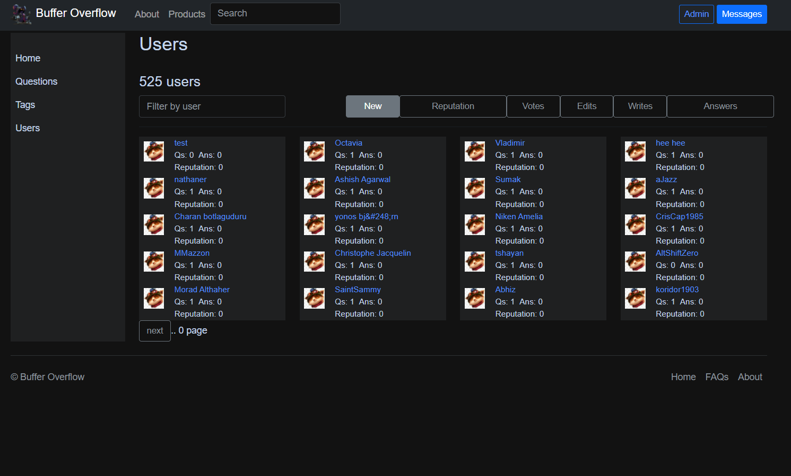

## Vue.js + Spring Boot Full-stack project
Java spring boot 와 vue.js 를 사용한 풀스택 프로젝트입니다. StackOverflow 를 모티브로 만들었습니다.

### Stacks
- Java Spring Boot
- Spring Data Jpa / QueryDsl
- Vue.js + Bootstrap

### Description
<!--

-->

### How to start
git clone [address]
#### Frontend
cd frontend && npm run start
#### Backend
cd backend && ./gradlew build

